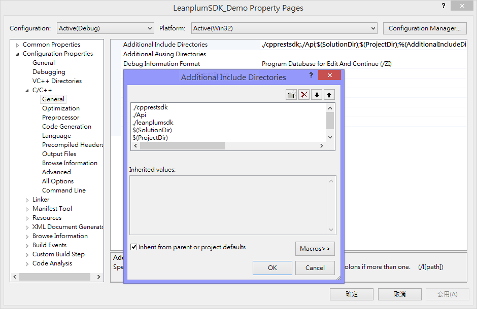
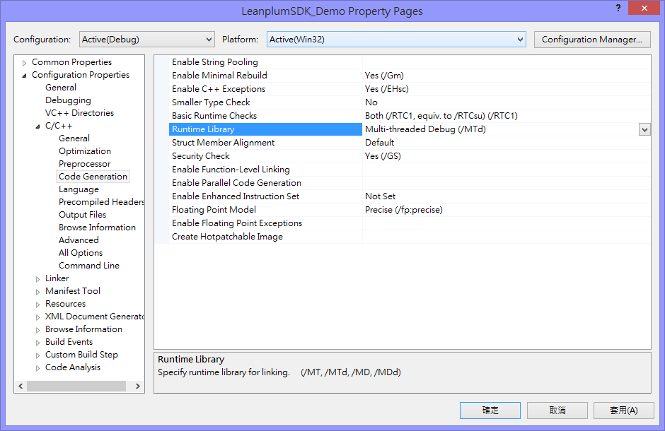
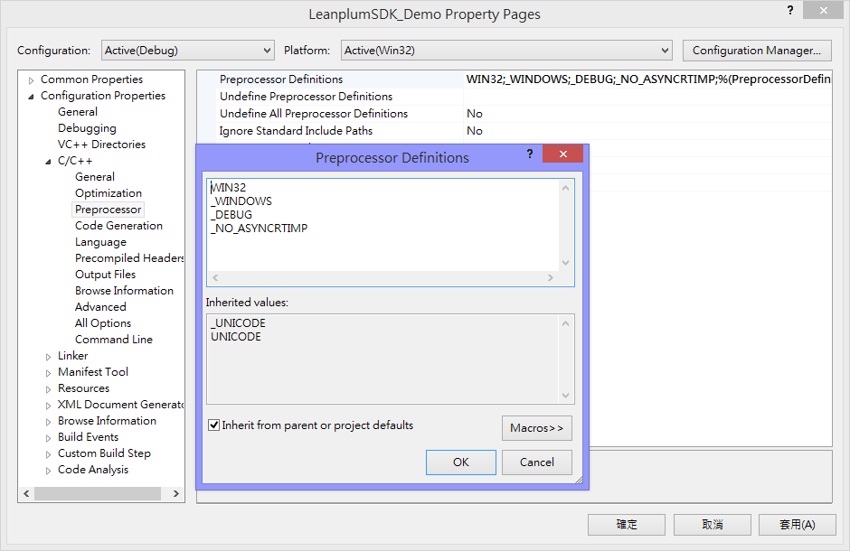
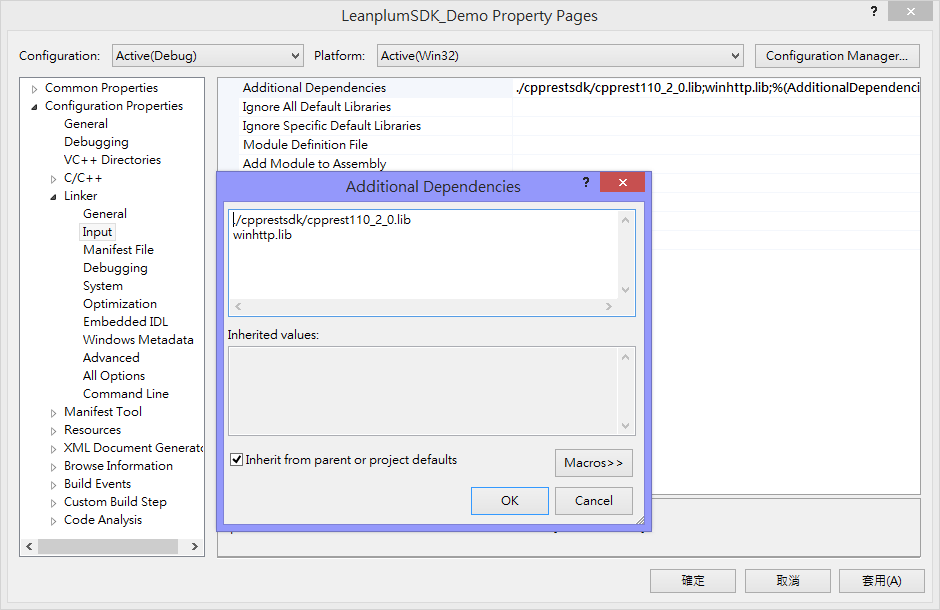

# windows_leanplum_sdk

## Install the SDK manually

### 1. Download files
Include api folder, cpprestsdk folder, leanplumsdk folder and jsoncpp folder.

### 2. Add all files into project
Project > Add > Existing item...

### 3. Edit the project property pages
- In C/C++ > General page, add api, cpprestsdk, and leanplumsdk path into "Additional Include Directories".

- In C/C++ > Code Generation page, choose "Multi-threaded Debug (/MTd)" runtime library.

Leanplum SDK uses [C++ REST SDK](https://casablanca.codeplex.com/) to connect to Leanplum servers, you need to add the settings like below to turn off exporting functions from the C++ Rest SDK dll, which is why it is applicable for static linking:
- In C/C++ > Preprocessor page, add _NO_ASYNCRTIMP into "Preprocessor Definitions".

- In Linker > Input page, add cpprest110_2_0.lib and winhttp.lib into "Additional Dependencies".

### 4. Include header files
Add the statements into your code:
    #include "InterfaceObserver.h"
    #include "Leanplum.h"

### 5. Create your class and inherit InterfaceObserver class
The SDK uses observer pattern to implement callback mechanism so your class needs to inherit InterfaceObserver class and implement the Notify() function.

    void DemoDlg::Notify(MessageCode::MESSAGE_CODE messageCode, WPARAM wParam, LPARAM lParam)
    {
    	if (MessageCode::MESSAGE_START_FINISH == messageCode) {
    		// do something after start a session
    	} else if (MessageCode::MESSAGE_GETVARS_FINISH == messageCode) {
    		// do something after get variables
    	} ...
    }

### 6. Declare a Leanplum object and add your own class (e.g., DemoDlg) to be the observer

    Leanplum leanplum;
    // register as an observer
    leanplum.AttachObserver(this);

### 7. Define your API keys
Define your API keys at the beginning.   

    leanplum.SetAppId(_T("app_..."));
	leanplum.SetProductionKey(_T("prod_..."));
	leanplum.SetDevelopmentKey(_T("dev_..."));
	leanplum.SetDataExportKey(_T("exp_..."));
	leanplum.SetContentReadonlyKey(_T("cro_..."));

To find yours, select your app in the leanplum dashboard, and click Apps. Under  Keys & Settings, click Show.

### 8. Define your Leanplum content variables
Use _DefineVariable(CString name, std::pair<VARIABLE_TYPE, CString> value)_ function to declare variables. After definition, call _FinishVariablesDefinition()_ to finish.

    // define variables
	leanplum.DefineVariable(_T("Message"), std::make_pair(Leanplum::VARIABLE_TYPE::STRING, _T("Message content.")));
	leanplum.DefineVariable(_T("Number"), std::make_pair(Leanplum::VARIABLE_TYPE::INT, _T("1")));
	leanplum.FinishVariablesDefinition();

### 9. Before start a session
You need reset the leanplum object and set the current user ID and device ID.

    // do these before start a session
    // reset and initial leanplum object
    leanplum.ResetApisData();
    // set user info
    leanplum.SetUserId(userid);
    leanplum.SetDeviceId(deviceid);
    // start a session
    leanplum.Start();

### 10. Insert code in your project
- Call Start() to start a session.
- Call SyncVariables() to sync variables with server as many times as you want.
- Call GetValuebyId() to get the variables after syncing with server.
- Remember to call Stop() in the end.

### 11. Run your project
Make sure you're enterprise customer because the REST API is only for enterprise customers.